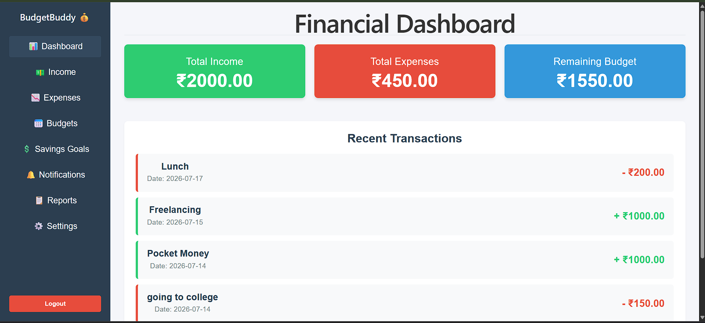

# 💰 BudgetBuddy – Personal Budget Planning & Expense Management Platform

BudgetBuddy is a full-stack web application that helps users manage their personal finances efficiently. The application enables users to securely register, log in, and maintain their financial records through a modern and user-friendly interface.

This project is being developed using **Django REST Framework** for the backend and **React (Vite)** for the frontend.

---

# 📌 Project Overview

Managing personal finances manually can be time-consuming and error-prone. BudgetBuddy aims to simplify financial management by providing a centralized platform for tracking income, expenses, budgets, and savings goals.

Currently, Milestone 1 focuses on establishing the project architecture, authentication system, backend APIs, and frontend setup.

---

# ✨ Features

## ✅ Implemented (Milestone 1)

- User Registration
- User Login
- JWT Authentication
- Secure Password Encryption
- React Frontend Setup
- Django REST Framework Backend
- Basic Dashboard
- Django Admin Panel
- SQLite Database Integration
- REST API Testing using Postman

---

## 🚧 Upcoming Features

- Income Management
- Expense Management
- Budget Planning
- Savings Goals
- Financial Reports
- Charts & Analytics
- Notifications
- User Profile Management

---

# 🛠️ Technology Stack

## Frontend

- React 19
- Vite
- React Router DOM
- HTML5
- CSS3
- JavaScript

## Backend

- Python
- Django
- Django REST Framework
- Simple JWT Authentication

## Database

- SQLite (Development)
- PostgreSQL (Future Deployment)

## Development Tools

- Git
- GitHub
- Visual Studio Code
- Postman

---

# 📂 Project Structure

```
BudgetBuddy/
│
├── backend/
│   ├── users/
│   ├── income/
│   ├── expenses/
│   ├── manage.py
│   └── db.sqlite3
│
├── frontend/
│   ├── src/
│   ├── public/
│   ├── package.json
│   └── vite.config.js
│
├── screenshots/
│
├── README.md
├── PROJECT_SCOPE.md
├── DATABASE_SCHEMA.md
├── ANALYSIS.md
├── MILESTONE_1_REPORT.md
├── LICENSE
└── .gitignore
```

---

# 🔐 Authentication

BudgetBuddy uses **JWT (JSON Web Token)** authentication for secure user access.

## Authentication APIs

| Method | Endpoint | Description |
|---------|----------|-------------|
| POST | `/api/users/register/` | Register a new user |
| POST | `/api/token/` | Login |
| POST | `/api/token/refresh/` | Refresh Access Token |

---

# ⚙️ Installation Guide

## 1. Clone the Repository

```bash
git clone https://github.com/your-username/BudgetBuddy.git
```

---

## 2. Backend Setup

```bash
cd backend

python -m venv .venv
```

### Activate Virtual Environment

Windows

```bash
.venv\Scripts\activate
```

Linux / macOS

```bash
source .venv/bin/activate
```

Install Dependencies

```bash
pip install -r requirements.txt
```

Run Database Migrations

```bash
python manage.py migrate
```

Start Django Server

```bash
python manage.py runserver
```

---

## 3. Frontend Setup

```bash
cd frontend

npm install

npm run dev
```

---

# 📸 Screenshots

## Login Page


---

## Register Page


---

## Dashboard



---

## Django Admin Panel


---

## User Registration API


---

## User Login API


---

## Project Structure


---

## Backend Server


---

## Frontend Server


---

## Database


---

# 📊 Milestone 1 Progress

| Module | Status |
|---------|--------|
| Requirement Analysis | ✅ Completed |
| Database Design | ✅ Completed |
| Django Backend Setup | ✅ Completed |
| React Frontend Setup | ✅ Completed |
| JWT Authentication | ✅ Completed |
| User Registration | ✅ Completed |
| User Login | ✅ Completed |
| Dashboard Skeleton | ✅ Completed |
| Income Module | ⏳ In Progress |
| Expense Module | ⏳ In Progress |
| Budget Module | ⏳ Pending |
| Savings Goals | ⏳ Pending |
| Reports & Analytics | ⏳ Pending |

---

# 🎯 Future Enhancements

- Income & Expense CRUD Operations
- Budget Management
- Savings Goal Tracking
- Interactive Charts & Analytics
- Monthly Financial Reports
- Email Notifications
- PDF & Excel Report Export
- Responsive Dashboard
- Cloud Deployment

---

# 👨‍💻 Developer

**Karuna**

**B.Tech – Computer Science & Engineering (AI & ML)**

Malla Reddy University, Hyderabad

---

# 📄 License

This project has been developed for learning, academic, and internship purposes.

---

⭐ If you found this project useful, consider giving it a **Star** on GitHub!
