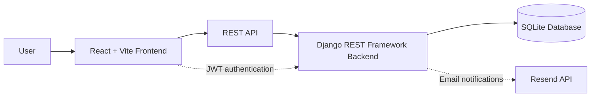

# 💰 BudgetBuddy

BudgetBuddy is a full-stack personal budget planning and expense management web application. It helps users manage income and expenses, create budgets, set savings goals, receive notifications, view analytics, and generate financial reports.

## ✨ Features

- User registration, login, and JWT authentication
- Dashboard with income, expense, budget, and savings insights
- Income and expense management
- Budget management and savings goals
- Notifications and email alerts
- Analytics, charts, reports, and summaries
- Input validation, error handling, and automated testing
- Production deployment for frontend and backend

## 🚀 Live Demo

- **Frontend:** [https://budgetbuddy-frontend-opal.vercel.app/](https://budgetbuddy-frontend-opal.vercel.app/)
- **Backend:** [https://budgetbuddy-backend-mm28.onrender.com/](https://budgetbuddy-backend-mm28.onrender.com/)

## 🛠️ Tech Stack

| Area | Technology |
| --- | --- |
| Frontend | React, Vite, React Router, Axios, Recharts |
| Backend | Django, Django REST Framework |
| Database | SQLite |
| Authentication | JWT / Simple JWT |
| Email notifications | Resend API |
| Reports | ReportLab |
| Deployment | Vercel and Render |

## 🔄 Application Flow



## 📁 Project Structure

```text
backend/
  manage.py              - Django project entry point
  users/                 - Authentication and user features
  income/                - Income management
  expenses/              - Expense management
  budgets/               - Budgets and savings goals
  notifications/         - Notifications and email alerts
  analytics/             - Dashboard analytics
  reports/               - Financial reports
frontend/
  src/                   - React application source
screenshots/milestone4/  - Milestone 4 evidence
```

## ⚙️ Run Locally

### Backend

```bash
cd backend
python -m venv venv
venv\Scripts\activate
pip install -r requirements.txt
python manage.py migrate
python manage.py runserver
```

### Frontend

```bash
cd frontend
npm install
npm run dev
```

## 📊 Project Highlights

BudgetBuddy combines financial dashboards, analytics and charts, PDF reports, notifications, validation, automated testing, and production deployment in one application.

## 📸 Screenshots

Project screenshots and milestone evidence are available in the [`screenshots/`](screenshots/).

## 👩‍💻 Author

**Nallagatla Saiharshitha**

- GitHub: [@Saiharshitha9](https://github.com/Saiharshitha9)
