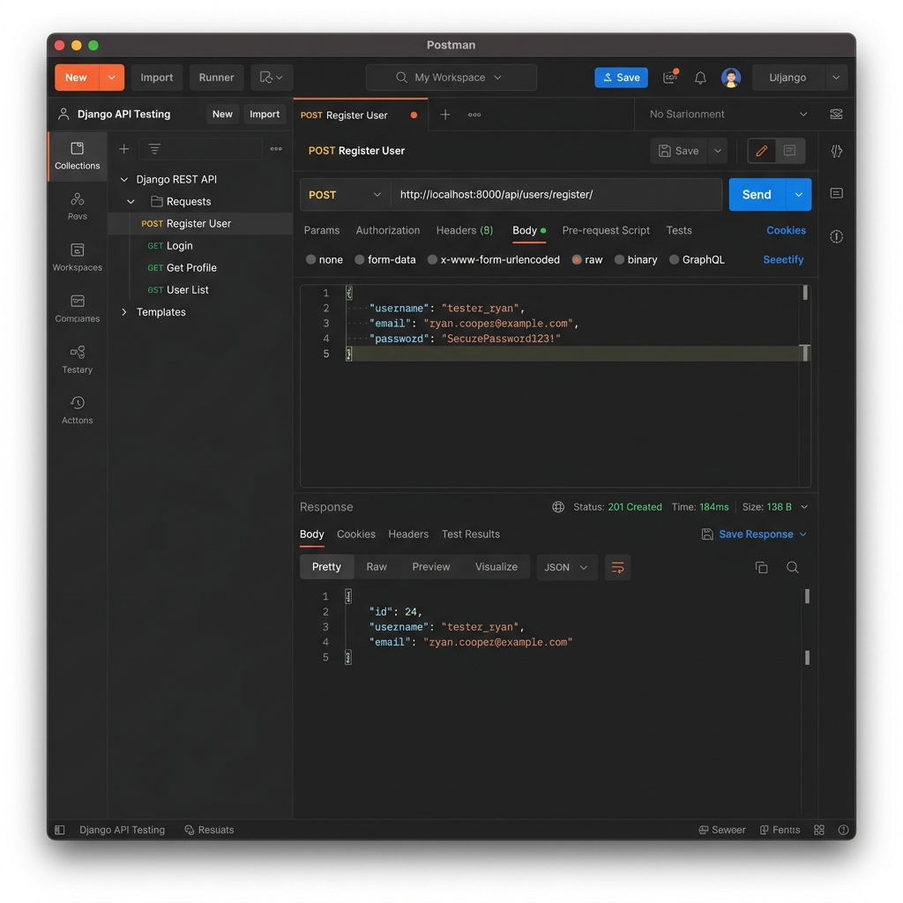
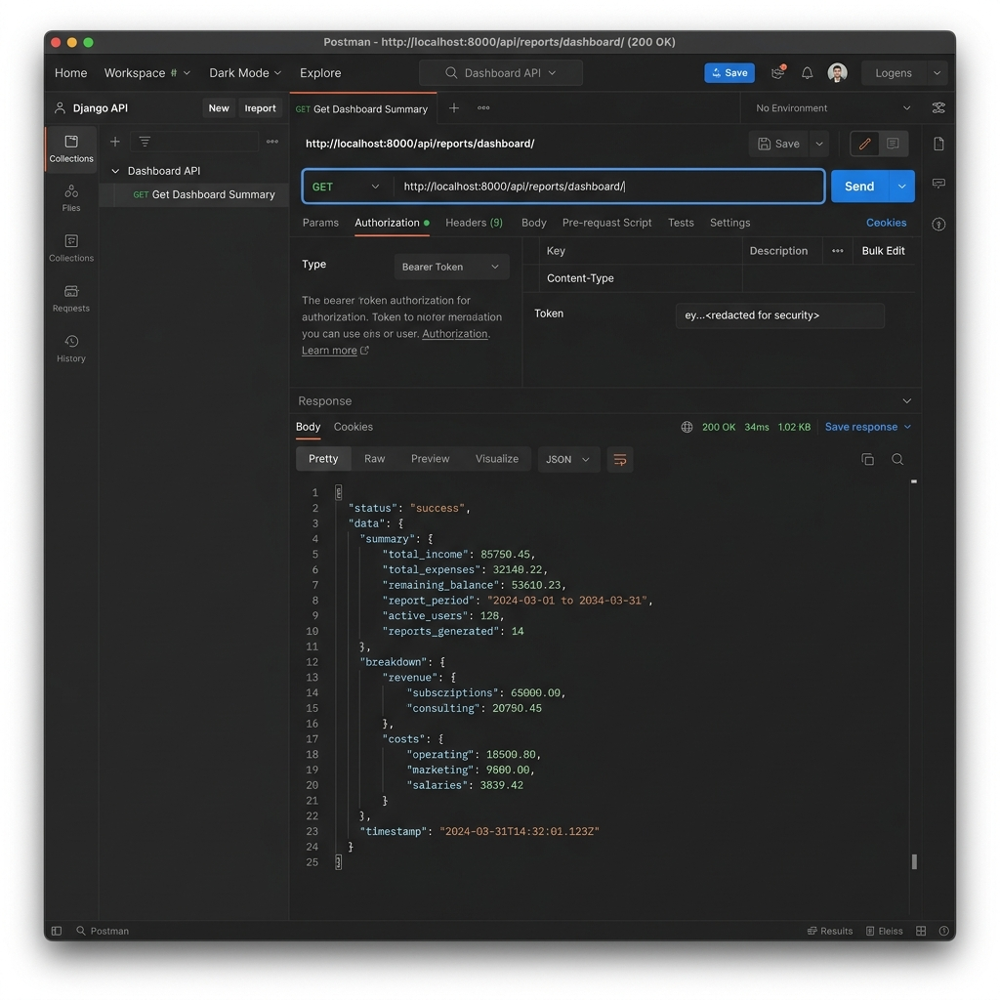

# 💰 BudgetBuddy – Personal Budget Planning & Expense Management Platform

## 📌 Overview

BudgetBuddy is a web-based Personal Budget Planning and Expense Management Platform designed to help users efficiently manage their income, expenses, budgets, and financial goals. The application provides an intuitive interface for tracking daily transactions, analyzing spending patterns, and generating insightful reports to improve financial decision-making.

The project is built using **Python (Django)** for the backend and **HTML, CSS, JavaScript, and Bootstrap** for the frontend, with **SQLite** as the database.

---

## ✨ Features

- 👤 User Registration & Secure Authentication
- 💵 Income Management
- 💳 Expense Tracking
- 📊 Budget Creation & Monitoring
- 📈 Financial Dashboard
- 📅 Monthly & Yearly Reports
- 🔍 Transaction History
- 🏷️ Expense Categorization
- 📤 Data Export (CSV/PDF if implemented)
- 🔒 Secure User Sessions
- 📱 Responsive User Interface

---

## 🛠️ Tech Stack

### Frontend
- HTML5
- CSS3
- Bootstrap
- JavaScript

### Backend
- Python
- Django

### Database
- SQLite3

### Tools
- Git
- GitHub
- VS Code
- Django Admin

---

## 📂 Project Structure

```
BudgetBuddy/
│
├── accounts/
├── expenses/
├── income/
├── budgets/
├── reports/
├── templates/
├── static/
│   ├── css/
│   ├── js/
│   └── images/
├── media/
├── db.sqlite3
├── manage.py
├── requirements.txt
└── README.md
```

---

## 🚀 Installation

### 1. Clone the Repository

```bash
git clone https://github.com/your-username/BudgetBuddy.git
```

### 2. Navigate to the Project Folder

```bash
cd BudgetBuddy
```

### 3. Create a Virtual Environment

**Windows**

```bash
python -m venv venv
venv\Scripts\activate
```

**Linux/Mac**

```bash
python3 -m venv venv
source venv/bin/activate
```

### 4. Install Dependencies

```bash
pip install -r requirements.txt
```

### 5. Apply Migrations

```bash
python manage.py makemigrations
python manage.py migrate
```

### 6. Create a Superuser (Optional)

```bash
python manage.py createsuperuser
```

### 7. Run the Development Server

```bash
python manage.py runserver
```

Open your browser and visit:

```
http://127.0.0.1:8000/
```

---

## 📊 Modules

### User Management
- User Registration
- Login
- Logout
- Profile Management

### Income Management
- Add Income
- Edit Income
- Delete Income
- View Income History

### Expense Management
- Add Expenses
- Edit Expenses
- Delete Expenses
- Categorize Expenses

### Budget Management
- Create Monthly Budget
- Budget Alerts
- Budget Tracking

### Reports
- Monthly Expense Summary
- Income vs Expense Report
- Budget Utilization
- Spending Trends

---

## 📈 Dashboard

The dashboard provides:

- Total Income
- Total Expenses
- Remaining Balance
- Budget Utilization
- Recent Transactions
- Expense Category Breakdown
- Monthly Financial Summary

---

## 📷 Screenshots & Postman Tests

Here are screenshots showing the successful implementation and verification of the BudgetBuddy APIs via Postman:

### 1. User Registration API
Verification of `POST /api/users/register/` returning a `201 Created` status with the registered user profile details.



### 2. Dashboard Summary API
Verification of `GET /api/reports/dashboard/` returning user dashboard statistics (Total Income, Total Expenses, Balance, etc.).



---

## 🔐 Authentication

BudgetBuddy uses Django's built-in authentication system paired with Django REST Framework SimpleJWT to provide:

- Secure Password Hashing
- User Login & Session Management
- JWT Access and Refresh Token flow
- Granular API view access controls

---

## 🔌 API Endpoints

The following REST API endpoints are fully implemented and functional:

### Authentication & User Management
| Method | Endpoint | Description | Auth Required |
|--------|----------|-------------|---------------|
| `POST` | `/api/users/register/` | Register a new user | No |
| `POST` | `/api/token/` | Obtain JWT Access and Refresh Tokens | No |
| `POST` | `/api/token/refresh/` | Refresh existing JWT Access Token | No |
| `GET` | `/api/users/profile/` | Get current user's profile info | Yes (JWT) |
| `PUT` | `/api/users/profile/` | Update user profile | Yes (JWT) |

### Income Management
| Method | Endpoint | Description | Auth Required |
|--------|----------|-------------|---------------|
| `GET` | `/api/income/` | List all incomes for the user | Yes (JWT) |
| `POST` | `/api/income/` | Add a new income record | Yes (JWT) |
| `GET` | `/api/income/<id>/` | Get details of a specific income | Yes (JWT) |
| `PUT` | `/api/income/<id>/` | Update an income record | Yes (JWT) |
| `DELETE` | `/api/income/<id>/` | Delete an income record | Yes (JWT) |
| `GET` | `/api/income/summary/` | Get monthly Income vs Expense summary | Yes (JWT) |

### Expense Management
| Method | Endpoint | Description | Auth Required |
|--------|----------|-------------|---------------|
| `GET` | `/api/expenses/` | List user expenses (supports category & date filters) | Yes (JWT) |
| `POST` | `/api/expenses/` | Add a new expense record | Yes (JWT) |
| `GET` | `/api/expenses/<id>/` | Get details of a specific expense | Yes (JWT) |
| `PUT` | `/api/expenses/<id>/` | Update an expense record | Yes (JWT) |
| `DELETE` | `/api/expenses/<id>/` | Delete an expense record | Yes (JWT) |
| `GET` | `/api/expenses/total/` | Get total amount of expenses | Yes (JWT) |

### Budgeting
| Method | Endpoint | Description | Auth Required |
|--------|----------|-------------|---------------|
| `GET` | `/api/budgets/` | List all budget limits | Yes (JWT) |
| `POST` | `/api/budgets/` | Set a new budget category limit | Yes (JWT) |
| `GET` | `/api/budgets/<id>/` | Get budget detail | Yes (JWT) |
| `PUT` | `/api/budgets/<id>/` | Update budget limits | Yes (JWT) |
| `DELETE` | `/api/budgets/<id>/` | Delete a budget limit | Yes (JWT) |

### Savings Goals
| Method | Endpoint | Description | Auth Required |
|--------|----------|-------------|---------------|
| `GET` | `/api/savings/` | List all savings goals | Yes (JWT) |
| `POST` | `/api/savings/` | Create a new savings goal | Yes (JWT) |
| `GET` | `/api/savings/<id>/` | Get details of a savings goal | Yes (JWT) |
| `PUT` | `/api/savings/<id>/` | Update savings goal progress | Yes (JWT) |
| `DELETE` | `/api/savings/<id>/` | Delete a savings goal | Yes (JWT) |

### Notifications & Reports
| Method | Endpoint | Description | Auth Required |
|--------|----------|-------------|---------------|
| `GET` | `/api/notifications/` | List user notifications (e.g. budget exceed alerts) | Yes (JWT) |
| `PATCH` | `/api/notifications/<id>/` | Mark a notification as read | Yes (JWT) |
| `GET` | `/api/reports/dashboard/` | Get financial dashboard summary values | Yes (JWT) |
| `GET` | `/api/reports/history/` | Get historical reports | Yes (JWT) |

---

## 📦 Requirements

Example:

```
Django
Pillow
django-crispy-forms
crispy-bootstrap5
```

Install using:

```bash
pip install -r requirements.txt
```

---

## 🎯 Future Enhancements

- Email Notifications
- SMS Budget Alerts
- AI-Based Expense Prediction
- Expense OCR (Receipt Scanner)
- Recurring Transactions
- Mobile Application
- Multi-Currency Support
- Data Visualization with Charts
- Export Reports to Excel & PDF
- Cloud Database Integration

---

## 🤝 Contributing

1. Fork the repository
2. Create a new branch

```bash
git checkout -b swathi
```

3. Commit your changes

```bash
git commit -m "Added new feature"
```

4. Push to GitHub

```bash
git push origin swathi
```

5. Create a Pull Request

---

## 👩‍💻 Author

**Swathi Polavaram**

- B.Tech – Computer Science & Data Science
- LinkedIn: https://www.linkedin.com/in/swathi-polavaram-7787b02a6

---

## 📄 License

This project is developed for educational and learning purposes.

---

## ⭐ If you like this project

Give it a ⭐ on GitHub and feel free to contribute!
